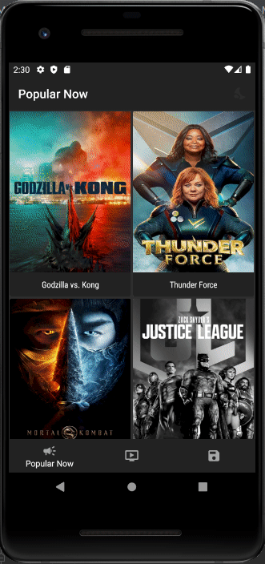

# Lab3 - Lab4 - PAM  

## Implemented features:

### Lab 3: 
- Used *The Movie Database API* to retrieve data about popular and top rated movies;
- Used *Retrofit* and *Kotlin Coroutines*;
- Implemented 4 screens: *Popular Now, Top Rated, Movie Details, Saved Movies*;
- Added *Bottom Navigation Bar*;

### Lab 4: 
- Used *MVVM* architecture(following this guides: 
https://blog.mindorks.com/mvvm-architecture-android-tutorial-for-beginners-step-by-step-guide,
https://medium.com/hongbeomi-dev/create-android-app-with-mvvm-pattern-simply-using-android-architecture-component-529d983eaabe,
https://www.toptal.com/android/android-apps-mvvm-with-clean-architecture)

In my app I have 2 application layers: data layer and ui layer + utils package;

Also, to achieve the structure from the below image I have used AAC Components like LiveData, Lifecycle, ViewModel +
DataBinding + Coroutines + Repository Pattern. For local and remote data sources I have used Room(to save movies info to 
database) and Retrofit(to retrieve data from API).

## Demo

