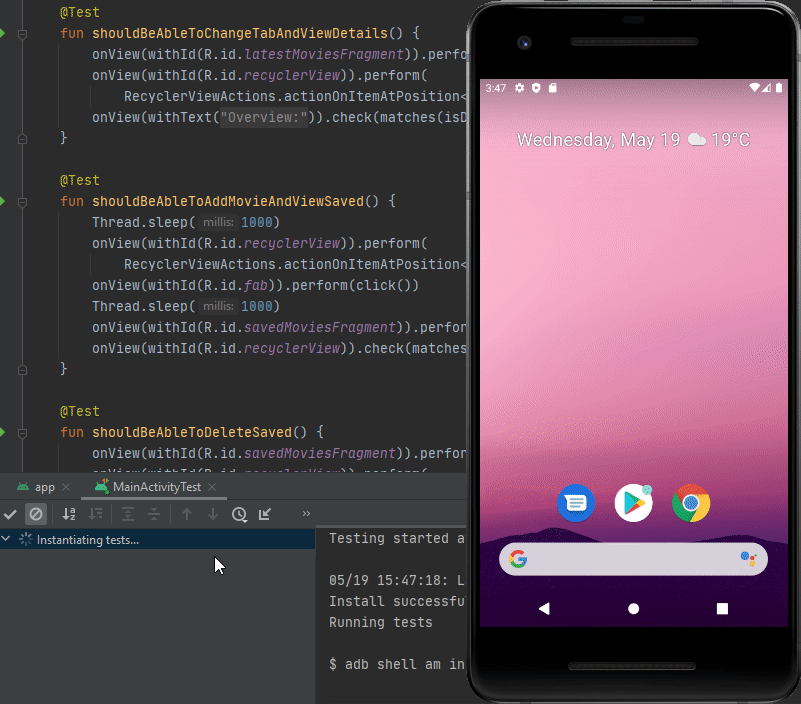

# Lab 5- PAM

## Tasks:

*Cover at least 3 Business Logic Modules with Unit Tests. Use only build in platform frameworks for tests. For iOS it is XCTest, for Android it is JUnit.
Unit tests are tests which check if some specific class behaves in the right way. Please don't test UI or Network Requests with unit tests.
Don't use concrete implementation of classes which are injected to your tested module, Use mocks and stubs in order to fake behavior of injected modules. Unit tests should be written and run isolated, this means that you must not to have Network Requests in your Unit Tests, Mock your API service and inject it inside your business logic module at start of test if you need it inside tested module.*

Select and add at least one test of next categories:

1. Integration tests - Tests which check integration of several modules of your app or platform. In context of mobile app these can be tests where you perform network requests to real or mocked API and check app API layer behavior, these test can include testing of serialization and deserialization, check of requests components, check of returned API response.

2. UI tests (a.k.a Automation Tests) - Tests which perform real user action of interaction with UI elements in automated way. Actually it is a code which press buttons and interact with your app

3. Snapshot tests - Tests which perform screenshot of your app and compare it with previously recorded reference image. These tests check if you don't break your UI accidentally during development. For this type of test you will need some third party frameworks, just google it, there are a lot of examples on github.  

## Implemented features:
- UI tests (a.k.a Automation Tests) by creating the folowing @Tests ~ *shouldBeAbleToLoadInitialPage* ~ *shouldBeAbleToAddMovieAndViewSaved* ~ *shouldBeAbleToDeleteSaved* ~ *shouldBeAbleToChangeTheme(light/dark)* (see Demo)
- Testing Room Database using JUnit ~ inside the @Test function, I have inserted a movie to the database, and then I have called the query to get all movies from database. If the db table contains the inserted movie, then it works just fine.

## Demo

